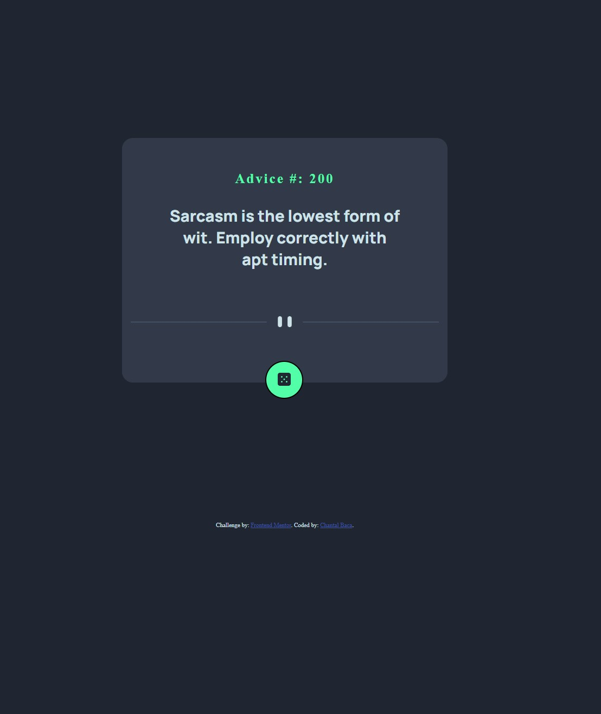

# Frontend Mentor - Advice generator app solution

This is a solution to the [Advice generator app challenge on Frontend Mentor](https://www.frontendmentor.io/challenges/advice-generator-app-QdUG-13db). Frontend Mentor challenges help you improve your coding skills by building realistic projects.

## Table of contents

- [Overview](#overview)
  - [The challenge](#the-challenge)
  - [Screenshot](#screenshot)
  - [Links](#links)
- [My process](#my-process)
  - [Built with](#built-with)
  - [What I learned](#what-i-learned)
- [Author](#author)

**Note: Delete this note and update the table of contents based on what sections you keep.**

## Overview
  This is a simple mock-up of a QR-Code-Component that shows Responsive Web Design through HTML and CSS.

### The challenge

Users should be able to:

- View the optimal layout for the app depending on their device's screen size
- See hover states for all interactive elements on the page
- Generate a new piece of advice by clicking the dice icon

### Screenshot

<a href="https://www.figma.com/file/klCL5DL6v7TXuYaAbaYT9D/Untitled?node-id=0%3A1&t=VG2m6PwTqe0ApiCE-1">Figma Mockup</a>

### Links

- Solution URL: [Solution Site](https://www.frontendmentor.io/solutions/advice-generator-app-using-api-3SjVVVLTGV)
- Live Site URL: [Live Site](https://ornate-sopapillas-9f0300.netlify.app/)

## My process
I began this process like many of my projects with creating a Mockup of what the project should look like using Figma. This is to continue my growth and understanding of Figma. Once the desgin was duplicated, I did my natural course of making HTML Elements fitting for the projects different sections. Then I added my CSS to visually interpert my Figma mockups. Lastly I did add my API using just a little bit of JavaScript. This shows how I can incorporate my knowledge of JavaScrip and the use of API's within my project. All of my site is responsive using Tailwind Media Query recommendations.

### Built with

- Semantic HTML5 markup
- CSS custom properties
- Flexbox
- JavaScript
- Advice Generator API

### What I learned

This project helped me revisit how to incoorporate API's within my projects. I really enjoyed taking a step back and relearning my process to include an API within my JavaScript. This has motivated me to work with more API projects coming soon.

## Author

- Website - [Chantal Baca](https://cbaca.dev/)
- Frontend Mentor - [@cbacaSE](https://www.frontendmentor.io/profile/CbacaSE)
- Twitter - [@cbacaSE](https://twitter.com/cbacaSE)

